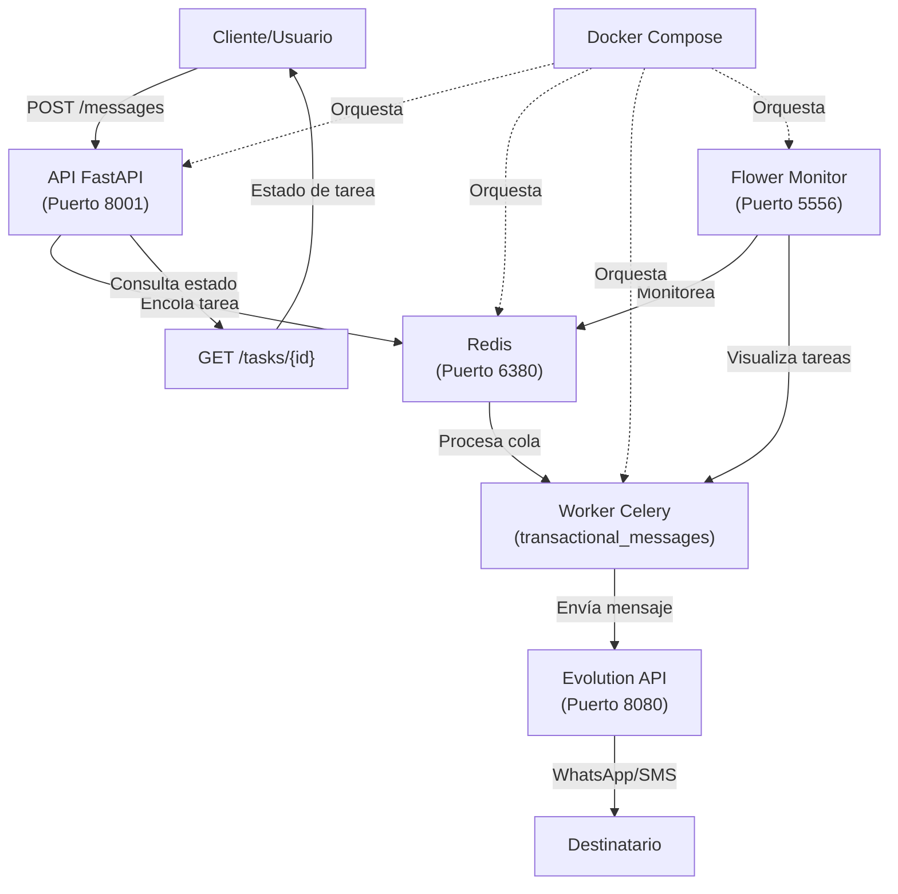

# 🚀 Microservicio de Mensajería FastAPI + Celery

Un microservicio robusto y escalable para el envío de mensajes transaccionales usando **FastAPI**, **Celery**, **Redis** y **Evolution API**.

## 📋 Tabla de Contenidos

- [Arquitectura del Sistema](#-arquitectura-del-sistema)
- [Características](#-características)
- [Requisitos Previos](#-requisitos-previos)
- [Instalación Rápida](#-instalación-rápida)
- [Configuración](#-configuración)
- [Uso del Sistema](#-uso-del-sistema)
- [API Endpoints](#-api-endpoints)
- [Monitoreo](#-monitoreo)
- [Comandos Útiles](#-comandos-útiles)
- [Troubleshooting](#-troubleshooting)
- [Estructura del Proyecto](#-estructura-del-proyecto)

## 🏗️ Arquitectura del Sistema



### Flujo de Procesamiento:
1. **Cliente** envía solicitud POST con teléfono y mensaje
2. **API FastAPI** valida datos y encola tarea en Redis
3. **Worker Celery** procesa la cola de mensajes
4. **Evolution API** recibe la solicitud y envía el mensaje
5. **Destinatario** recibe el mensaje vía WhatsApp/SMS

## ✨ Características

- ⚡ **Procesamiento Asíncrono**: Celery para manejo de colas
- 🔄 **Reintentos Automáticos**: Hasta 3 intentos con delay de 5s
- 📊 **Monitoreo en Tiempo Real**: Interfaz web con Flower
- 🐳 **Totalmente Dockerizado**: Fácil despliegue y escalabilidad
- 🔒 **Seguro**: Contenedores con usuarios no-root
- 📝 **Logging Completo**: Seguimiento detallado de todas las operaciones
- 🎯 **API RESTful**: Endpoints claros y documentación automática
- 🔧 **Configuración Flexible**: Variables de entorno para personalización

## 📋 Requisitos Previos

- **Docker** y **Docker Compose** instalados
- **Evolution API** corriendo en el servidor (puerto 8080)
- Puertos disponibles: `8001` (API), `6380` (Redis), `5556` (Flower)

## 🚀 Instalación Rápida

### 1. Clonar y Configurar

```bash
# Navegar al directorio del proyecto
cd python

# Copiar archivo de configuración
cp .env.example .env

# Editar configuración (IMPORTANTE)
nano .env
```

### 2. Configurar Variables de Entorno

Edita el archivo `.env` con tus datos:

```env
# Configuración de Evolution API
EVOLUTION_API_URL=http://localhost:8080
EVOLUTION_API_KEY=tu_api_key_real_aqui
EVOLUTION_INSTANCE_NAME=tu_instancia

# Configuración Redis (dejar por defecto)
REDIS_HOST=redis
REDIS_PORT=6379
REDIS_DB=0
```

### 3. Levantar el Sistema

```bash
# Construir e iniciar todos los servicios
docker-compose up --build

# O en modo detach (background)
docker-compose up --build -d
```

### 4. Verificar que Todo Funciona

```bash
# Verificar estado de los servicios
docker-compose ps

# Ver logs en tiempo real
docker-compose logs -f
```

## ⚙️ Configuración

### Variables de Entorno Disponibles

| Variable | Descripción | Default |
|----------|-------------|---------|
| `EVOLUTION_API_URL` | URL de tu Evolution API | `http://localhost:8080` |
| `EVOLUTION_API_KEY` | API Key de Evolution | *(requerido)* |
| `EVOLUTION_INSTANCE_NAME` | Nombre de la instancia | `default` |
| `REDIS_HOST` | Host de Redis | `redis` |
| `REDIS_PORT` | Puerto de Redis | `6379` |
| `APP_HOST` | Host de la API | `0.0.0.0` |
| `APP_PORT` | Puerto interno de la API | `8000` |

## 📱 Uso del Sistema

### Enviar un Mensaje

```bash
curl -X POST http://localhost:8001/messages \
  -H "Content-Type: application/json" \
  -d '{
    "phone": "+52123456789",
    "message": "Hola Carlos, este es un mensaje de prueba",
    "instance_name": "mi_instancia"
  }'
```

**Respuesta esperada:**
```json
{
  "success": true,
  "message": "Mensaje encolado correctamente para procesamiento",
  "task_id": "abc123-def456-ghi789"
}
```

### Consultar Estado de una Tarea

```bash
curl http://localhost:8001/tasks/abc123-def456-ghi789
```

**Respuesta esperada:**
```json
{
  "task_id": "abc123-def456-ghi789",
  "status": "SUCCESS",
  "result": {
    "success": true,
    "phone": "+52123456789",
    "evolution_key": "message_key_123"
  }
}
```

## 🌐 API Endpoints

### `GET /`
- **Descripción**: Health check básico
- **Respuesta**: Estado del servicio

### `GET /health`
- **Descripción**: Monitoreo de salud completo
- **Respuesta**: Estado detallado del sistema

### `POST /messages`
- **Descripción**: Enviar mensaje transaccional
- **Body**: `{"phone": "+521234567890", "message": "Tu mensaje", "instance_name": "mi_instancia"}`
- **Respuesta**: Confirmación de encolado con `task_id`

### `GET /tasks/{task_id}`
- **Descripción**: Consultar estado de tarea
- **Parámetros**: `task_id` (ID de la tarea)
- **Respuesta**: Estado y resultado de la tarea

### `GET /docs`
- **Descripción**: Documentación interactiva de la API
- **URL**: http://localhost:8001/docs

## 📊 Monitoreo

### Flower (Monitoreo de Celery)
- **URL**: http://localhost:5556
- **Funciones**:
  - Ver tareas en tiempo real
  - Estadísticas de workers
  - Historial de tareas
  - Métricas de rendimiento

### Logs del Sistema
```bash
# Logs de todos los servicios
docker-compose logs -f

# Logs específicos
docker-compose logs -f api      # Solo API
docker-compose logs -f worker   # Solo Worker
docker-compose logs -f redis    # Solo Redis
```

## 🛠️ Comandos Útiles

### Gestión del Sistema

```bash
# Iniciar sistema
docker-compose up -d

# Detener sistema
docker-compose down

# Reiniciar sistema
docker-compose restart

# Ver estado de servicios
docker-compose ps

# Reconstruir contenedores
docker-compose up --build

# Limpiar sistema completo
docker-compose down -v --rmi all
```

### Escalabilidad

```bash
# Aumentar workers de Celery
docker-compose up --scale worker=3 -d

# Verificar workers activos
docker-compose exec worker celery -A project.app.celery_app inspect active
```

### Debugging

```bash
# Acceder al contenedor de la API
docker-compose exec api bash

# Acceder al contenedor del worker
docker-compose exec worker bash

# Ver logs específicos con timestamp
docker-compose logs -f --timestamps api
```

## 🐛 Troubleshooting

### Problemas Comunes

#### 1. **Error de conexión a Evolution API**
```bash
# Verificar que Evolution API esté corriendo
curl http://localhost:8080/health

# Verificar configuración en .env
cat .env | grep EVOLUTION
```

#### 2. **Redis no conecta**
```bash
# Verificar estado de Redis
docker-compose exec redis redis-cli ping

# Debería responder: PONG
```

#### 3. **Worker no procesa tareas**
```bash
# Ver logs del worker
docker-compose logs worker

# Reiniciar worker
docker-compose restart worker
```

#### 4. **Puerto en uso**
```bash
# Verificar puertos disponibles
netstat -tulpn | grep :8001

# Cambiar puerto en docker-compose.yml si es necesario
```

### Estados de Tareas Celery

| Estado | Descripción |
|--------|-------------|
| `PENDING` | Tarea encolada, esperando procesamiento |
| `STARTED` | Tarea comenzó a procesarse |
| `SUCCESS` | Tarea completada exitosamente |
| `FAILURE` | Tarea falló después de todos los reintentos |
| `RETRY` | Tarea reintentándose |

## 📁 Estructura del Proyecto

```
python/
├── project/
│   └── app/
│       ├── __init__.py          # Paquete principal
│       ├── main.py              # API FastAPI
│       ├── celery_app.py        # Configuración Celery
│       ├── celery_worker.py     # Worker Celery
│       ├── tasks.py             # Tareas de procesamiento
│       ├── models.py            # Modelos Pydantic
│       └── config.py            # Configuración global
├── requirements.txt             # Dependencias Python
├── Dockerfile                   # Imagen para API
├── Dockerfile.worker           # Imagen para Worker
├── docker-compose.yml          # Orquestación de servicios
├── .env.example                # Plantilla de configuración
└── README.md                   # Esta documentación
```

## 🎯 Próximos Pasos

1. **Configurar Evolution API** con tus credenciales reales
2. **Ajustar puertos** si hay conflictos en tu servidor
3. **Configurar monitoreo** adicional si es necesario
4. **Personalizar reintentos** según tus necesidades
5. **Implementar autenticación** para endpoints en producción

---

## 📞 Soporte

Para problemas o preguntas sobre el sistema:

1. Revisar logs: `docker-compose logs -f`
2. Verificar estado: `docker-compose ps`
3. Consultar documentación: http://localhost:8001/docs
4. Monitorear con Flower: http://localhost:5556

**¡El sistema está listo para procesar mensajes de forma robusta y escalable! 🚀** 